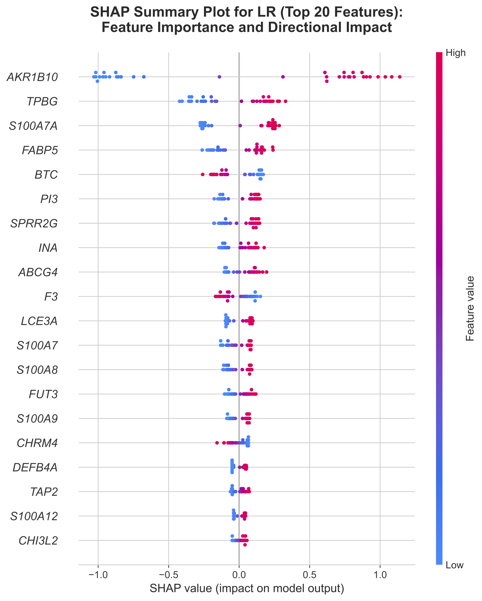

# Robert Jacques, MSc (Distinction)
### Interdisciplinary Clinical Data Scientist | Specialist Optometrist (17+ Years)

I bridge **17+ years of clinical diagnostic experience in optometry** with specialised expertise in **Explainable AI (XAI)** and **Data Visualisation**. My research focusses on engineering transparent, visually intuitive tools that resolve the "trust barrier" in high-dimensional healthcare data.

---

## 🏆 Research & Clinical Recognition
* **NYHDIF Dissertation Prize (2025):** Awarded for excellence in applied digital health research.
* **MSc Data Science (Distinction):** **86%** Dissertation (XAI focus) | **83%** Data Visualisation (ASSERT framework focus).
* **Clinical Seniority:** 17+ years in Optometry | **Professional Certificate in Medical Retina** (Grade: 85%).

## 🛠️ Technical Expertise

| Domain | Professional Implementation & Methodology |
| :--- | :--- |
| **Explainable AI** | Expert implementation of **SHAP** to address the "multiplicity problem" in high-dimensional genomic models. |
| **Visualisation** | Mastery of the **ASSERT framework** to manage clinician cognitive load and engineer intuitive visual hierarchies. |
| **Scalable Analytics** | Distributed workflows using **PySpark** and **Azure Databricks** for N-gram analysis and pattern matching. |
| **Data Engineering** | Precision pre-processing including **$log_{2}$ transformation**, **IQR filtering**, and **Standardisation**. |

  
   
  <em>Figure 1: Global feature importance (SHAP) identifying high-impact biomarkers while maintaining clinical transparency.</em>

---

## 📁 Key Research Projects

* 🧬 **[Psoriasis Classification & XAI](https://github.com/robert-jacques/INF6000-Dissertation-Psoriasis-ML)** (86%) — *INF6000 (Dissertation)*
  Developed a multi-model pipeline to identify a five-gene consensus signature (*BTC*, *CHI3L2*, *LCE3A*, *S100A9*, *SPRR2G*) from 21,510 genomic features. **NYHDIF Prize Winner.**

* 📊 **[Music Feature Analysis & Visualisation](link)** (83%) — *INF4000*
  Applied the **ASSERT framework** to the Spotify Tracks Dataset to analyse mood-based audio feature variance. Engineered inclusive designs for **Colour Vision Deficiency** using the `viridis` palette.

* 📉 **[Predictive Modelling & PCA](link)** (76%) — *INF6027*
  Investigated relationships between musical valence and audio features using **Principal Component Analysis (PCA)** for dimensionality reduction and latent pattern extraction.

* ☁️ **[Big Data Analytics & PySpark](link)** (73%) — *INF6032*
  Utilised **PySpark** on **Databricks** to analyze Wikipedia and MAGPIE datasets.
  * **Highlights:** Implemented **NGram transformers** for phrase extraction and used **Window functions** for distributed ranking. Identified 67 unique idiomatic matches using **Inner Joins** across large-scale corpora.

---

## 📫 Contact
📧 [robert.jacques@tutanota.com](mailto:robert.jacques@tutanota.com) | 🔗 [LinkedIn](https://linkedin.com/in/r-a-jacques)
